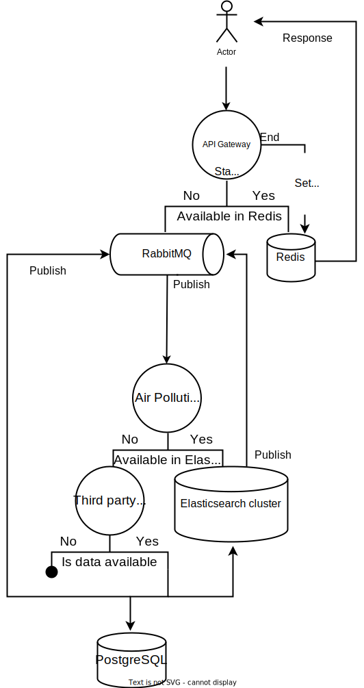

# Air Condition Micreservices

Hello, this project is a microservice for obtaining **Air Pollution** data. this microservice has been written in python.
in this microservice, I used various services such as **RabbitMQ**, **Redis**, **Postgresql**, **Elasticsearch**, and **Celery**.


## Setup project

Use below commands to setup the project:

**make build**

**make migrate**

**make index**

## Air pollution endpoint

To call **Air Pollution** API, use below command in terminal: 
```console
curl -X POST http://127.0.0.1:8000/air-pollution -d '{"lat": 50, "lon": 50, "date_string": "2022-11-07"}' -H 'Content-Type: application/json'
```
**Response**
```console
{
  "message": "Wait for 2 seconds"
}
```
If you call this API for the first time and the result is not already available in Redis, you will receive this message.
If you call this API again, you will receive air pollution data.

```console
{
  "components": {
    "co": 200.27,
    "nh3": 0.07,
    "no": 0,
    "no2": 0.72,
    "o3": 44.35,
    "pm10": 0.55,
    "pm2_5": 0.5,
    "so2": 0.35
  },
  "dt": 1667779200,
  "main": {
    "aqi": 1
  }
}
```


